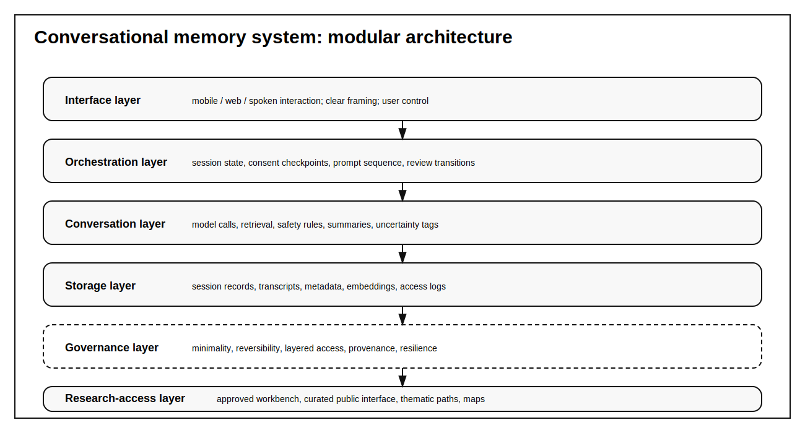
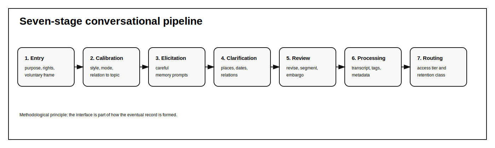
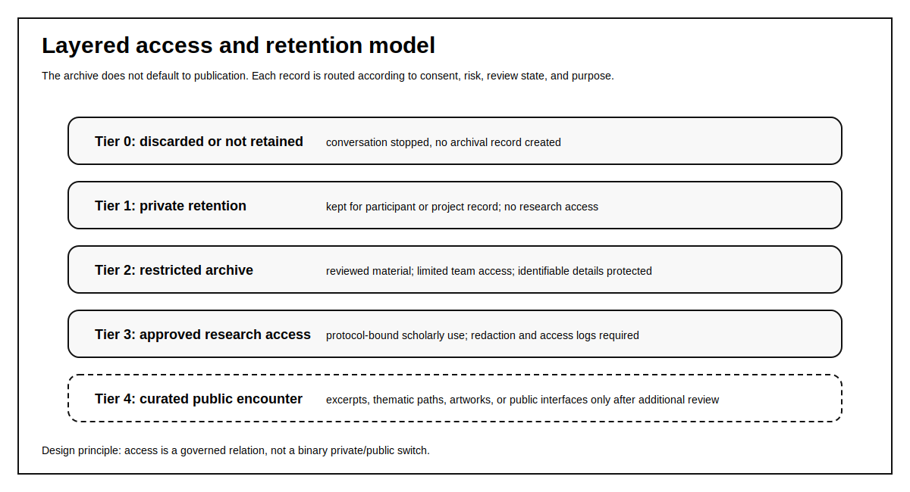
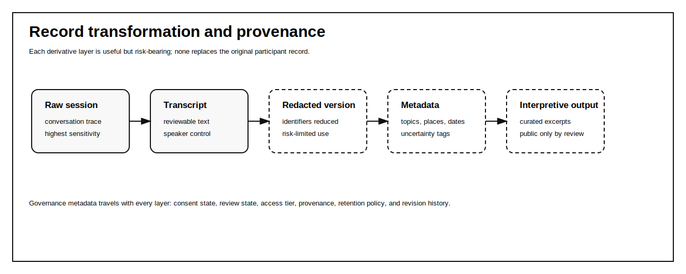

# Incomplete Reconstruction: Conversational AI, Collective Memory, and the Governance of an Archive of the Disappeared

## Working note

This is a draft for a full Research Paper submission to the AI & SOCIETY special collection on responsible AI in art creation and archival practice. It is designed to be distinct from the Open Forum paper, **Against Restoration**, which focuses on computational memorial imagery and the artwork triptych. This manuscript focuses on the broader archive, conversational memory capture, governance, and methodological framework.

For double-blind review, replace project names, repository paths, authorial self-references, acknowledgements, and self-citations with anonymised placeholders. Restore after review where allowed.

## Abstract

This article proposes a framework for the responsible use of conversational AI in the capture, preservation, and study of collective memories of detained-disappeared persons connected to Uruguay's civic-military dictatorship. It argues that AI-mediated memory work cannot be evaluated only through generic criteria of accuracy, usability, consent, or data protection. In contexts marked by enforced disappearance, archival incompletion, political denial, and intergenerational transmission of trauma, the central question is not simply whether an AI system can collect more testimony, but how it participates in the production of memory as an archival, social, and political form.

The paper presents a practice-based research project that develops a governed computational archive for memories of the disappeared in Uruguay. The project uses AI-based conversational interfaces not as neutral data-collection tools but as structured instruments for eliciting, preserving, and contextualising oral-style memory while preserving plurality, uncertainty, contradiction, silence, and participant agency. The article contributes: (1) a conceptual distinction between memory capture and archival extraction; (2) a modular architecture for conversational memory systems; (3) a governance model based on layered access, reversibility, provenance, minimality, and adversarial resilience; and (4) a methodological framework for evaluating AI-mediated memory work in politically sensitive contexts.

The central claim is that responsible AI archives of contested memory must resist the fantasy of synthetic historical completion. Their purpose is not to generate a single coherent account of the past, nor to replace existing archives, forensic work, legal processes, or the labour of relatives and human-rights organisations. Rather, they must create protected conditions under which situated voices can be captured, curated, studied, and, where appropriate, publicly encountered without reducing memory to extractable data.

## Keywords

responsible AI; collective memory; conversational AI; archives; enforced disappearance; Uruguay; human rights; AI governance; oral history; digital humanities

## 1. Introduction

Collective memories are being lost. In post-dictatorship societies such as Uruguay, a substantial part of the memory of political violence remains housed in living persons rather than in stable archival institutions. Relatives, former classmates, neighbours, co-workers, militants, teachers, students, journalists, local activists, and ordinary citizens continue to carry fragments of what happened: a remembered name, a rumour, a fear, a school absence, a phrase repeated in a family, a place avoided, an atmosphere of silence, a partial story of detention, exile, imprisonment, or disappearance. Many of these memories have never entered formal archives. Some may never be narrated unless conditions exist for their narration.

Artificial intelligence appears to offer new possibilities for this problem. Conversational systems can lower the barrier to participation, support oral-style interaction, adapt prompts to participants, generate metadata, assist transcription and redaction, and create pathways for later scholarly retrieval. Yet the same systems can also distort memory, over-structure narrative, extract sensitive data, simulate empathy, normalise surveillance, and convert contested memories into computationally convenient records. The problem is therefore not whether AI can help collect memory. It is under what conditions AI may participate responsibly in the construction of an archive.

This article examines that question through a practice-based research project concerned with collective memories of detained-disappeared persons connected to Uruguay's civic-military dictatorship. The project proposes a computational, humanistic, and artistic framework for capturing, preserving, governing, and studying memories of the disappeared. Its starting point is the recognition that enforced disappearance is not only a crime located in the past. It is a continuing violence whose effects persist through unresolved absence, incomplete records, legal struggle, family memory, public commemoration, and political denial. An AI system that enters this field does not operate on neutral content. It enters a dense political and ethical infrastructure of truth, justice, trauma, evidence, and memory.

This manuscript extends, rather than repeats, the author's earlier conference paper on AI-supported memory capture. The previous paper established the project and its preliminary motivation. The present article develops the journal-length contribution: governance architecture, conversational pipeline, access model, evaluation framework, adversarial risk analysis, and a sharper distinction between archival co-production and extractive data capture.

## 2. Historical and archival problem

Uruguay's civic-military dictatorship lasted from 1973 to 1985 and produced systematic human-rights violations, including political imprisonment, torture, exile, censorship, surveillance, and enforced disappearance. The dictatorship belongs to a broader Southern Cone history of state terror and transnational repression, including operations that crossed national borders and connected Uruguayan victims to events in Argentina and elsewhere.

The disappeared occupy a specific position within this history. Disappearance does not end with the removal of the person. It continues through the concealment of bodies, the destruction or withholding of records, the dispersal of testimony, the uncertainty imposed on relatives, and the political management of oblivion. A disappeared person remains socially present through an unresolved absence. Names, photographs, legal files, commemorative acts, family narratives, and public demands for truth and justice keep the disappeared in circulation, but often in fragmentary and unequal ways.

This produces a difficult archival condition. Some materials are public and institutionalised: lists of victims, judicial documents, public reports, human-rights organisation records, biographical entries, sites of memory, and historical studies. Other materials remain informal, private, or dispersed: memories held by persons who were not direct relatives, small episodes that never entered testimony, place-based recollections, rumours, affective atmospheres, political interpretations, inherited family stories, and everyday silences. These latter materials are often historically meaningful precisely because they show how political violence entered ordinary life.

The archive imagined in this project is therefore not only a repository of testimony. It is a sociotechnical structure for preserving plurality. It must be able to hold contradictory memories, partial memories, uncertain memories, emotional memories, and memories that are not directly evidentiary but are nevertheless culturally and historically significant. It must also accept that not every memory should become public. Responsible preservation does not equal indiscriminate publication.

## 3. From memory capture to archival co-production

The phrase memory capture can be misleading if it implies that memories exist as stable objects that can simply be extracted and stored. Collective memory is produced through narration, circulation, repetition, omission, conflict, and institutional framing. It is social before it is computational. A person does not narrate the same memory in every context. They speak differently to a relative, an interviewer, a museum, a judge, a journalist, a student, or an AI-mediated interface. The interlocutor matters.

Conversational AI makes this problem sharper. Unlike a passive recording device, a conversational system prompts, follows up, summarises, categorises, and sometimes suggests. It may invite detail, but it may also impose shape. It may encourage a participant to continue, but it may also make a traumatic memory feel bureaucratically processed. It may provide accessibility for people who would not write a formal testimony, but it may also create a false impression that the machine understands the historical weight of what is being said.

For this reason, the project treats AI-mediated memory capture as archival co-production. The system is part of the conditions under which the memory becomes recordable. Its design must therefore be evaluated not only technically but epistemologically and politically. What does it ask? What does it not ask? What forms of hesitation does it allow? What does it do with contradiction? Does it summarise too early? Does it ask for unnecessary personal data? Does it make the participant feel that a single narrative must be completed? Does it preserve the difference between a raw conversational trace, a transcript, a redacted version, metadata, and scholarly interpretation?

## 4. System architecture

The project proposes a modular architecture organised into six layers: interface, orchestration, conversational intelligence, storage, governance, and research access. These layers are conceptually distinct even when implemented within the same software environment.

**Figure 1. System architecture.** Modular architecture for a conversational memory system, separating interface, orchestration, model-mediated conversation, storage, governance, and research access.

The interface layer consists of mobile-first and web-based conversational clients. Text interaction provides a baseline because it is technically robust and easy to review. Voice input and playback should be supported where appropriate because oral-style communication is central to memory work and may be more accessible for participants with limited literacy, limited comfort with formal writing, or stronger familiarity with spoken narration.

The orchestration layer coordinates dialogue flow, session state, consent checkpoints, prompt selection, and transitions between conversational stages. It encodes the methodological logic of the encounter: entry and framing, relational calibration, elicitation, clarification, participant review, processing, and governance routing.

The conversational intelligence layer integrates language models with task-specific prompting strategies, controlled retrieval, safety rules, and post-processing functions such as summarisation, metadata generation, uncertainty tagging, and candidate thematic labels. Its purpose is not to produce fluent conversation for its own sake, but to support careful memory work.

The storage layer separates raw interaction logs, audio files where applicable, transcripts, redacted transcripts, metadata, embeddings, and governance records. This separation is ethically necessary because different forms of data carry different risks.

The governance layer manages identity protection, consent states, participant rights, retention policies, role-based access control, audit logs, and procedures for freezing, revising, reclassifying, or withdrawing records. Governance is implemented both technically and institutionally. It cannot be left as an external policy document detached from the code.

The research-access layer provides interfaces for approved uses of the archive. These may include controlled researcher workbenches, public-facing visualisations, thematic collections, search tools, timelines, maps, or curated excerpts. Research access should not mean direct access to raw data by default.

## 5. Conversational pipeline

The conversational pipeline comprises seven stages.

**Figure 2. Conversational pipeline.** Seven-stage pipeline from entry and consent framing through review, processing, and governance routing.

First, the system introduces the project, explains its purpose, clarifies that participation is voluntary, and describes what kinds of data may be retained. Second, it asks whether the participant prefers a guided or open style, text or voice, shorter or longer responses, and whether they want to share their relation to the topic. Third, it prompts memories using careful questions about people, places, events, atmospheres, routines, silences, rumours, public rituals, fears, absences, and later recollections. Fourth, it asks follow-up questions to clarify references, temporal markers, relationships among actors, place names, and possible ambiguities. Fifth, the participant is offered the option to review, revise, segment, embargo, or delete parts of the interaction before it becomes an archival record. Sixth, the system generates a protected raw record, a working transcript, and a derived set of metadata. Seventh, materials are routed into different retention classes: private, archived but restricted, research-accessible under protocol, publicly excerptable, or artistically reusable only with additional permission.

The important point is that the pipeline treats consent and interpretation as continuing processes rather than one-time checkboxes. The archival record is not simply collected at the beginning and published at the end. It is formed through staged interactions, review points, and governance decisions.

## 6. Governance principles

The governance model is based on six principles: minimality, reversibility, layered access, provenance, adversarial resilience, and interpretive humility.

**Minimality** means that the system should collect only the data necessary for the interaction and for the archival purpose explicitly agreed to by the participant. **Reversibility** means that participants should retain the possibility, within defined limits, of withdrawing, revising, or reclassifying their contributions. **Layered access** means that there should not be a single public archive by default. **Provenance** means that every record should preserve the conditions under which it was produced. **Adversarial resilience** means that the system should anticipate misuse, political harassment, disinformation, scraping, doxxing, and hostile reinterpretation. **Interpretive humility** means that the system should not present its summaries, clusters, or themes as definitive historical interpretation.

**Figure 3. Layered access model.** Access is treated as a governed relation rather than a binary choice between private and public records.

## 7. Record transformation and provenance

One of the most important design problems is the transformation from a conversational encounter into an archival object. A raw session, audio recording, transcript, redacted version, metadata record, embedding, excerpt, and scholarly interpretation are not the same thing. They carry different risks and different evidentiary status.

**Figure 4. Record transformation and provenance.** Transformation from raw interaction to transcript, redaction, metadata, and interpretive output, with governance metadata travelling across layers.

The system must therefore retain the distinction between original trace and derivative layer. It must allow researchers to understand how a record was produced, what was removed, what was inferred, what was generated automatically, and what was added through human review. It must also distinguish between uncertainty expressed by the participant and uncertainty introduced by transcription, redaction, or metadata generation.

## 8. Evaluation framework

The evaluation framework should be multi-layered. Technical evaluation should test transcription quality, retrieval reliability, metadata consistency, redaction support, access-control enforcement, and auditability. Humanistic evaluation should examine whether the system preserves uncertainty, contradiction, silence, narrative specificity, and the situated voice of participants. Ethical evaluation should examine whether participants understand the project, retain meaningful agency, and can withdraw or reclassify materials. Governance evaluation should test whether different access tiers actually prevent inappropriate circulation. Public evaluation should examine whether curated outputs communicate the limits of the archive rather than presenting computational organisation as historical resolution.

This evaluation differs from standard chatbot evaluation. The goal is not maximum fluency or user engagement. A system that is too fluent, too consoling, too curious, or too eager to summarise may be harmful in this context. The more relevant question is whether the system supports careful narration without converting memory into extractable content.

## 9. Discussion

The project contributes to the special collection's concern with responsible AI in art creation and archival practice by treating AI responsibility as a matter of institutional form, not only model behaviour. The responsible object is not the language model alone. It is the entire sociotechnical arrangement: interface, prompts, consent, storage, metadata, access, review, public presentation, and institutional accountability.

The paper also contributes a distinction between incompletion and failure. In conventional information systems, incompletion often appears as a problem to solve. In the context of disappearance, archival incompletion is not a neutral deficit. It is partly the effect of a political crime. A responsible archive should preserve incompletion where it marks uncertainty, violence, or unresolved absence. It should not turn every gap into an invitation for inference.

## 10. Conclusion

Conversational AI can support memory work, but only if it is governed against its own extractive tendencies. In the context of the disappeared, the task is not to maximise collection, automate interpretation, or generate a coherent synthetic account. The task is to create conditions in which situated memories can be narrated, protected, reviewed, preserved, and, when appropriate, encountered by others without being stripped of uncertainty and context.

Responsible AI archives of contested memory must therefore be incomplete by design. They should collect carefully, store different layers separately, preserve provenance, maintain access tiers, and resist the fantasy that computation can complete the archive. Their contribution is not to resolve disappearance, but to sustain the fragile social, archival, and political conditions under which memory can continue to be spoken.

## References

AI & SOCIETY. 2026. "CfP: Collection on Responsible use of AI in Art Creation and Archival Practice." Springer Nature. Accessed 18 June 2026. https://link.springer.com/journal/146/updates/27850936.

Achugar, Mariana. 2008. *What We Remember: The Construction of Memory in Military Discourse*. Amsterdam: John Benjamins.

Caswell, Michelle. 2021. *Urgent Archives: Enacting Liberatory Memory Work*. London: Routledge.

Derrida, Jacques. 1996. *Archive Fever: A Freudian Impression*. Translated by Eric Prenowitz. Chicago: University of Chicago Press.

Dignum, Virginia. 2019. *Responsible Artificial Intelligence: How to Develop and Use AI in a Responsible Way*. Cham: Springer.

Hirsch, Marianne. 2012. *The Generation of Postmemory: Writing and Visual Culture After the Holocaust*. New York: Columbia University Press.

Jelin, Elizabeth. 2003. *State Repression and the Labors of Memory*. Minneapolis: University of Minnesota Press.

Madres y Familiares de Uruguayos Detenidos Desaparecidos. n.d. "Desaparecidos." Accessed 18 June 2026. https://desaparecidos.org.uy/.

Nora, Pierre. 1989. "Between Memory and History: Les Lieux de Mémoire." *Representations* 26: 7-24.

Secretaría de Derechos Humanos para el Pasado Reciente. n.d. "Víctimas." Gobierno de Uruguay. Accessed 18 June 2026. https://www.gub.uy/secretaria-derechos-humanos-pasado-reciente/victimas.

Sitios de Memoria Uruguay. n.d. "Desaparición forzada." Accessed 18 June 2026. https://sitiosdememoria.uy/desaparicion-forzada.

Stilgoe, Jack, Richard Owen, and Phil Macnaghten. 2013. "Developing a Framework for Responsible Innovation." *Research Policy* 42(9): 1568-1580.

Taylor, Diana. 2003. *The Archive and the Repertoire: Performing Cultural Memory in the Americas*. Durham, NC: Duke University Press.

Unidad Reguladora y de Control de Datos Personales. 2020. "Resolución N° 30/020." Gobierno de Uruguay, 12 May 2020. Accessed 18 June 2026. https://www.gub.uy/unidad-reguladora-control-datos-personales/institucional/normativa/resolucion-n-30020.

Unidad Reguladora y de Control de Datos Personales. 2020. "Guía de Evaluación de Impacto en la Protección de Datos." Gobierno de Uruguay, 28 January 2020. Accessed 18 June 2026. https://www.gub.uy/unidad-reguladora-control-datos-personales/comunicacion/publicaciones/guia-evaluacion-impacto-proteccion-datos.

### Author's prior work to cite only if double-blind rules allow, or anonymise as Author

Author. 2024. "Capturing Collective Memories of the Disappeared with Artificial Intelligence." *Advances in Artificial Intelligence - IBERAMIA 2024*, LNCS 15277.
